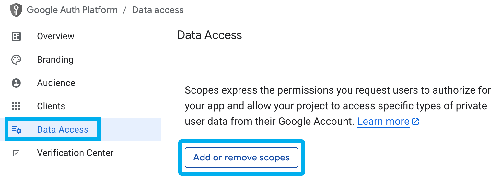

import Image from 'next/image'
import { Callout } from 'nextra/components'

import PGSImage from '../../../images/PlayConsoleLeftTabPGSConfig.png'

# Authentication with Google Play Games
For those who looking to leverage the amazing features of Google Play Games in their Unreal Engine Projects,
EIK has you covered.

## 1. Setup Keystore for Android
For setting up the Google Cloud project, we'll need a keystore in place, so let us set that up first.

<Callout type="warning">
Make sure you have JDK installed and in your `PATH`, check this by opening your Terminal/CMD and running  
`echo %JAVA_HOME%` - On Windows  
`echo $JAVA_HOME` - On MacOS  
If a valid path is printed pointing to your JDK's location, then JDK is installed and most probably in your `PATH` as well.
</Callout>

1. Run this command  
   `keytool -genkey -v -keystore key_name.keystore -alias alias_name -keyalg RSA -keysize 2048 -validity 10000`  
   Then fill in the prompted values and confirm, you should see a similar output as below:  
   

2. Copy your keystore file into `Project/Build/Android/key_name.keystore`

3. Go to `Project Settings` -> `Android` (Under Platforms)

4. Click configure

5. Scroll down to `Distribution Signing` tab.

6. Fill in the keystore details  
   

7. Go to `Project Settings` -> `Packaging` (Under Project).

8. Under Project, Set `Build Configuration` to `Shipping` and Tick `For Distribution`  
   

9. Then, once again, open your Terminal/CMD, cd into `Project/Build/Android` and run the following command:  
   `keytool -keystore key_name.keystore -list -v`  
   Enter the keystore password when prompted

10. You should see a similar output, you need to copy the `SHA1` value and store it somewhere safe as we will need it while creating an `OAuth Client` in Step 2.  
    

---

## 2. Setup Google Cloud project

1. First, we need to setup a Google Cloud project, so go to your Google Cloud Console and [Create a new project](https://console.cloud.google.com/projectcreate).

2. Enter an appropriate project name and click Create.

3. Then after the project has been created, click `SELECT PROJECT`  
   

4. On the left panel, select `OAuth consent screen`, then click `Get started`  
   

5. Fill in all the necessary details about your game, then click `Create`  
   

6. Click `Create OAuth client`  
   

7. Fill in the Package name found in `Project Settings` -> `Android` (Under Platforms) -> `Android Package Name`

8. Fill in the `SHA-1 certificate fingerprint` as saved in Step 1.  
   

9. Click `Create` at the bottom of the page.

<Callout type="info">
You don't need to store the `Client ID`
</Callout>

10. Go to `Data Access`, and click `Add or remove scopes`  
    

11. In the `Filter` bar, search for `Google Play Games Services API` and select it. Then, select the THREE scopes shown below:  
    

12. Click `Update`, then click `Save`

---

## 3. Setup Play Console Project

First, we need to setup a Google Play Console project for our game. So open up your console and follow these steps:

1. Click `Create app` on the Home page  
   

2. Make sure you set `App or game` to `Game`  
   

3. Click `Create app`

4. After the app is created, on the left tab, go to `Grow Users` -> `Play Games Services` -> `Setup and management` -> `Configuration`  
   <Image src={PGSImage} alt="Go to Grow Users -> PGS -> Configuration button" height={600} style={{ maxWidth: '100%', height: 'auto' }} />

5. Select Create new Play Games Services project. Then choose the Cloud project that we created in Step 2. Then click `Use` on bottom of the screen

<Callout type="warning">
Make sure you don't click `Create new cloud project` as we've already done that in Step 2
</Callout>

   

6. Then you should see the steps to `Set up Play Games Services` as follows:  
   

7. Click the second option `Create OAuth consent screen in Google Cloud Platform` then instantly click `Confirm configuration` as we've done that in Step 2.

8. Scroll down to `Credentials` and click `Add credential`.

9. Make sure the `Type` is set to `Android`, then scroll down to `Authorization` and select the `OAuth Client` that we created in Step 2.  
   

10. Click `Save changes`

11. Go back to the `Configuration` page.

12. Ignore the rest of the steps to `Set up Play Games Services`

13. Click on `Edit properties`  
    

14. If you want to use the `Saved Games` feature, turn it on, otherwise ignore this step.  
    

15. Go back to the configuration page.

16. Copy the `Project ID` as shown below:  
    

17. Go to `Project Settings` -> `EOS Integration Kit` (Under Game), and paste it in the `Google Play Games App ID`  
    

---

## You're all set!
Congratulations, you're now all set to use the amazing features provided by `Google Play Games Services` with the help of EOS Integration Kit!  
Now, just build your project for Android and watch it automatically login with `Google Play Games Services`!

----

**Here are the available nodes for Google Play Games Services with EIK:**  
  

