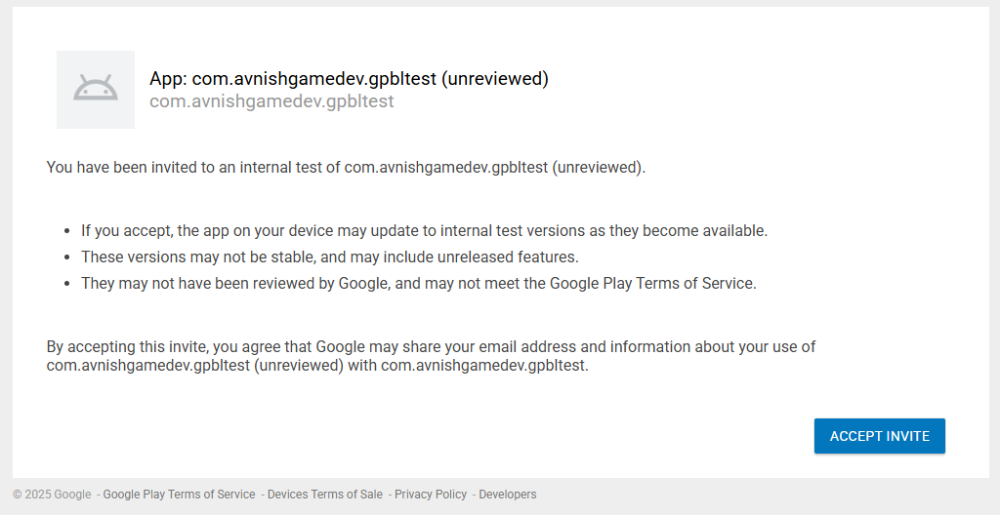
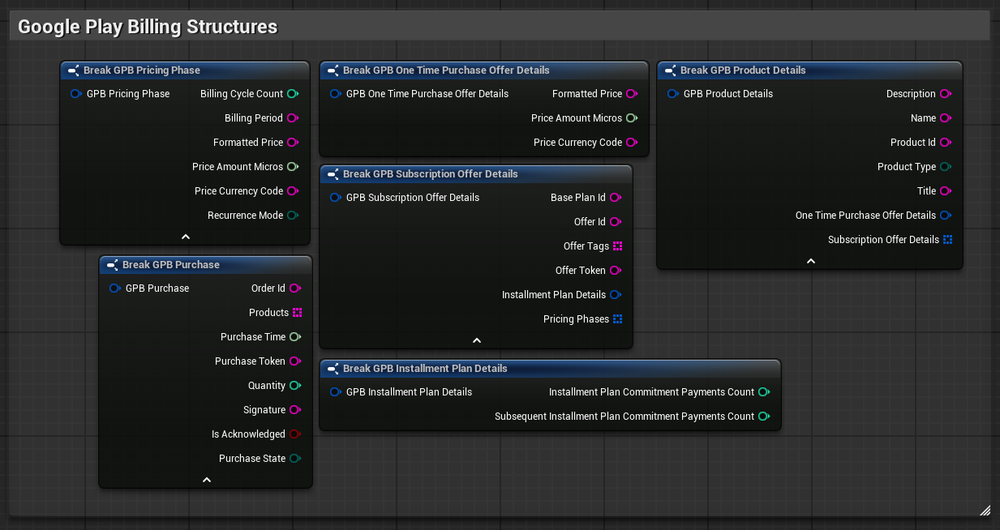

import Image from 'next/image'
import { Callout } from 'nextra/components'

<Callout type="info" emoji="📱">
  Google Play Billing is only supported on <strong>Android</strong> platform.
</Callout>

## 1. Packaging an App bundle for Play Console
Before setting up the Play Console, we need to build an App Bundle, this is an one time process
<Callout type="warning" emoji="🔑">
Please follow the steps to `Setup Keystore for Android` from [Authentication → Methods → Google Play Games](../Authentication/methods/google_play_games) before following these steps. But you don't need the `SHA1` for setting up Billing.
</Callout>

1. Go to your `Project Settings` → `EOS Integration Kit` then tick `Enable Google Play Billing`
    

2. Go to `Project Settings` → `Android`, and under App Bundles, tick `Generate bundle (AAB)`
    

<Callout type="info">
Suggested API levels are:

</Callout>

3. Close `Project Settings`

4. Now package your project for Android to get the AAB
    

<Callout type="warning">
Before packaging, make sure to set `Android Package Name` in `Project Settings` → `Android` to what you want in your Play Console, this cannot be changed in the future.
</Callout>
<Callout type="warning">
Make sure Enable Google Play Billing is ticked in `Project Settings` → `EOS Integration Kit` before Packaging
</Callout>

## 2. Settings up License Testing
Now, open your Play Console.
To test Play Billing purchases, you need to setup License Testing on your Play Console:

1. Go back to your main Play Console account dashboard where you see all the apps

2. Click on `Settings`
    

3. Go to `License Testing`
    

4. Create an email list if you don't have one

5. Name the list anything you want (e.g. `MyList`) and add one or more of your email addresses

6. Select the email list

7. Set `License response` to `RESPOND_NORMALLY`
    

8. Click `Save changes`

## 2. Setting up Google Play Console Testing
As of now, we need to setup a Test Release in order for Billing to work. Follow these steps to setup a Test Release:

1. Create a new App on your Console (if you don't already have one)

2. Go to `Monitor and improve` → `Policy and programs` → `App Content`
    

3. There, put a link to your Game's Privacy Policy, and click `Save`

4. Now, go to `Test and Release` → `Testing` → `Internal Testing`
    

5. Go to `Testers` tab, then select the email list you selected for License Testing

6. Click `Save`

7. Then go back to `Releases` tab, then click `Create new release`

8. Enter any release name you want

9. Upload the aab file we built before, then wait for it to upload and optimize

10. Click `Next`, then click `Save and publish`

11. After the Internal Testing release has been published, go to the `Testers` tab in `Internal Testing`, and copy your test link
    

12. Open the copied link on your Android device, then click `Accept Invite`
    

<Callout type="warning">
Make sure you're signed into one of the testing accounts that you entered in the list that we created in `Section 2 step 5`
</Callout>

## 3. Setting up In-app purchases
In sections 3 and 4, we'll be focusing on these menus:
    

1. Open your App's dashboard again

2. Go to `Monetize with Play` → `In-app products`

3. Click `Create product`

4. Enter an unique `Product ID`, this will be used as an input to our Blueprint code in future

5. Fill out the rest, and click `Save`, then click `Activate`

## 4. Setting up Subscriptions

1. Go to `Monetize with Play` → `Subscriptions`

2. Click `Create subscription`

3. Enter an unique `Product ID`, this will be used as an input to our Blueprint code in future

4. Enter the Subscription's `Name`, then click `Create`

5. Click `Add base plan`, Enter an unique `Base plan ID`, this can be optionally used in our Blueprint code if needed

6. Select all or needed `Country / region`, then click `Set price`, set your price and click `Update`, then click `Save`

7. Activate the subscription by clicking `Activate`

## 4. Implementing Play Billing logic
EIK Provides the following Google Play Billing Nodes and Structures:
    
    

<iframe src="https://blueprintue.com/render/vp9v8x0l/" scrolling="no" allowfullscreen width="100%" height="400px"></iframe>
Cannot view the code? [Click here](https://blueprintue.com/blueprint/vp9v8x0l/)

<Callout type="info">
Download the test widget [here](https://drive.google.com/uc?export=download&id=1vNKqfbFSoIcTWKXntVCLkx1j3puP_tMX). (UE 5.4 or above)
</Callout>

## Working Demo
<iframe src="https://drive.google.com/file/d/1OleGHHGHrO-ps4O0a7i8oM1JptYSVS3v/preview" width="100%" height="480" allow="autoplay"></iframe>

## Suggested Reads
[Target API level requirements for Google Play apps](https://support.google.com/googleplay/android-developer/answer/11926878?hl=en)

[Google Play's billing system](https://developer.android.com/google/play/billing)

[About subscriptions](https://developer.android.com/google/play/billing/subscriptions)

[Testing your integration](https://developer.android.com/google/play/billing/test)