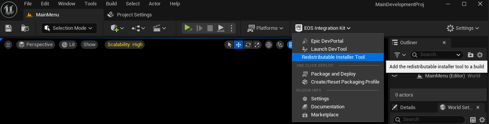
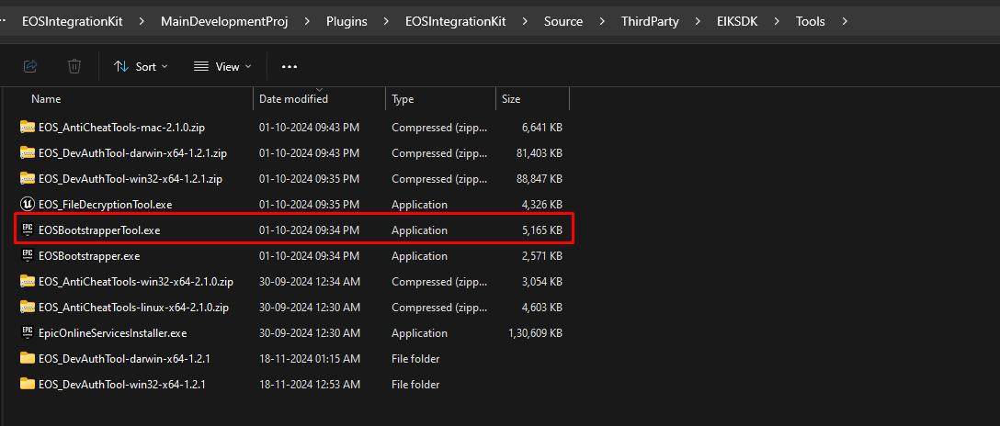

import { Callout } from 'nextra/components'

# Redistributable Installer

Not everyone who wants to use your game would have Epic Games Launcher installed. To make sure that your game can be played by everyone, you can use the redistributable installer provided by Epic Games.

In Epic's word : If your game is distributed on multiple PC storefronts, or independently of any storefront, you can use Epic Online Services (EOS) to integrate and unify the user authentication and social experience across each of your distributions. For example on Steam, using the in-game overlay of EOS, users will be able to see and interact with all of their Epic friends and Steam friends in a single list.


## Automatic Redistributable Installer

<Callout type="warning"> 
    If you are using Epic Easy Anti Cheat, make sure to select the anticheat exe inplace of the game exe when asked for the exe. (Usually named start_protected_game.exe)
</Callout>

If you using EOS Integration Kit 4.7 or later, you can use the automatic redistributable installer. 

  

When you select the Exe of your game, the redistributable installer will be added there and the exe will be patched to include the redistributable installer.


## Manual Redistributable Installer

To add the redistributable installer manually, you need to follow the steps below:


### Step 1: Download the redistributable installer

The redistributable installer is included in the EOS SDK in the **Tools** folder. 

  

### Step 2: Run CMD to create the redistributable installer

Open CMD and navigate to the redistributable installer folder. Run the following command:

```cmd
EOSBootstrapperTool.exe --output-path "C:\Path\To\Game\EOSBootstrapper.exe" --app-path "./YourGame.exe"
```

Example:

```cmd
EOSBootstrapperTool.exe --output-path "H:\Plugins\SteamIkProject\Windows\EOSBootstrapper.exe" --app-path ""./SteamIkProject.exe"
```

Boom! You have created the redistributable installer for your game. Now you can distribute it with your game and make sure that everyone can play your game without any issues.

